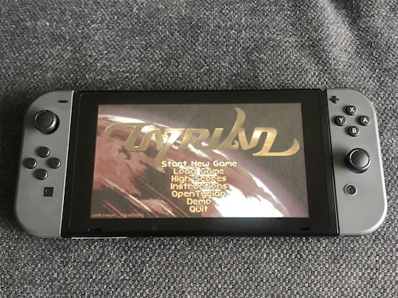
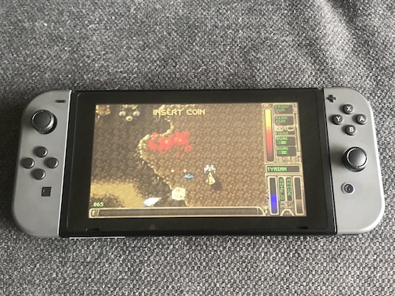

# opentyrian-nx - updated fork with fixes

OpenTyrian for the Nintendo Switch.

This fork fixes these issues of the [original port](https://github.com/theflippedbit/opentyrian-nx):
* controls not working on firmware 9.0.0 or later
* double keypresses in menus
* bullets fired by the player travelling in wrong directions

  

OpenTyrian source: https://github.com/opentyrian/opentyrian

## Installation
Unzip `opentyrian-nx` to the `switch` folder on your microSD card.

## Controls
Left Stick - ship movement  
A - fire weapons (select in menus)   
B - toggle rear weapon mode (back in menus)  
ZL/ZR or Y/X - fire left/right sidekick

## Building

### Install DevKitPro 
* Follow the instructions to install on your system https://devkitpro.org/wiki/devkitPro_pacman
* Execute `sudo (dkp-)pacman -S switch-dev` to install the tools and libraries for switch development, where (dkp-) is the path to pacman on your system
* Note: if installing on macOS Catalina, may need to follow these steps: https://github.com/devkitPro/pacman/issues/15
* Install switch-sdl2 packages: `sudo (dkp-)pacman -S switch-sdl2`

### Compile
* Execute `make` in the source folder
